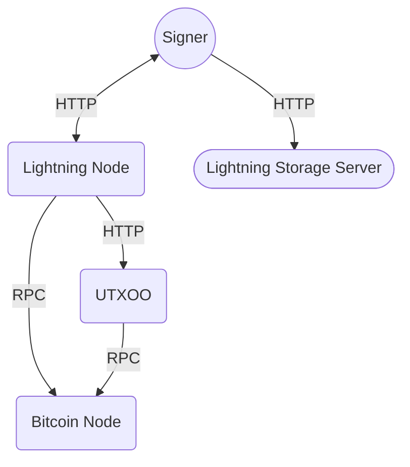

# Docker Run VLS

Let's get your node up and running!

---
layout: image-right
image: /lakshya.jpg
---

# Who am I?

><span v-mark="{ type: 'strike-through', color: '#fff' }">Genius, Billionaire, Playboy, Philanthropist?</span>

- Lakshya Singh
- Open Source Contributor \
  @ [Validating Lightning Signer](https://vls.tech)

<a href="https://github.com/king-11" rel="noreferer" target="_blank"><mdi-github /></a>
<a href="https://king-11.github.io/blog" rel="noreferer" target="_blank"><mdi-rss-box /></a>
<a href="https://twitter.com/1108King" rel="noreferer" target="_blank"><mdi-twitter-circle /></a>

```
Travels a lot, talks a lot, codes a lot
```

---
layout: image-right
image: https://cover.sli.dev
class: text-left
---

# Table of contents

<Toc minDepth="1" maxDepth="2"></Toc>

---
layout: two-cols
---

# Services

- Bitcoin Node
- Lightning Node
- UTXO Oracle (UTXOO)
- Validating Lightning Signer (VLS)
- Lightning Storage Server (LSS)

::right::



---
layout: section
---

# The Old Way

Setting up a lightning node with vls requires manual operation. To avoid all the manual labour you were using non-custodial lightning wallets like Phoenix, Breez, etc.

---

At a high level, for each service you have to:

- Download the git repo/tar ball
- Download and install the necessary dependencies
- Build the service binaries and copy them to right place
- Setup and start daemon service

---
layout: two-cols
class: px-8
---


>We don't like too exercise too Mr. Panda.

::right::

So let's make it a bit easier for you. You have docker installed right?

---
layout: image-right
image: https://king-11.github.io/blog/docker-run-vlsd.webp
---

# Docker Installation

| Operating System | Preferred Method |
|------------------|------------------|
| Linux            | [Install Docker Engine](https://docs.docker.com/engine/install/) |
| macOS            | [Install Docker Desktop](https://docs.docker.com/desktop/install/mac-install/) |
| Windows          | [Install Docker Desktop](https://docs.docker.com/desktop/install/windows-install/) |

---

# Building Docker Images

Now that you have setup let's download the docker files and create the necessary volumes.

```bash {1-2|3-5|none}
# clone the docker image and compose file repo
git clone https://gitlab.com/lightning-signer/vls-container.git
# build the docker images
cd vls-container
docker compose --profile vls build
```

<p v-click="3">
It's been running for a while now. Losing my patience here...
</p>

---

Let's use the cache from vls's gitlab container registry to build faster.

```bash {1-2|3-7|8-12}{at:1}
 # create a new builder
docker buildx create --name compose
 # export environment variables
export BUILDER=compose
export CACHE=registry.gitlab.com/lightning-signer/vls-container/cache
export IMAGE_TAG=latest
export CACHE_TAG=main
 # build the docker images using script for caching
./scripts/build_from_cache.sh bitcoind
./scripts/build_from_cache.sh lightningd
./scripts/build_from_cache.sh txoo
./scripts/build_from_cache.sh vls
```

---

# Run the Services

```bash {1-5|6-7}
# create volume for each of the services
docker volume create bitcoin_data
docker volume create lightning_data
docker volume create txoo_data
docker volume create vls_data
# start the services
docker compose --profile vls up
```

---

<p class="flex py-4 justify-center">


</p>

---

To expose the ports on the host machine we have to use overrides.

Currently we support the following overrides:
- <span v-mark.underline.red>testnet</span>
- <span v-mark.underline.yellow>regtest</span>

```bash
  # start the services with overrides
docker compose --profile vls -f docker-compose.yml -f docker-compose.testnet.yml up -d
```

---

It is recommended to run the VLS service separately on a <span v-mark="{ color: '#f7931b', type: 'highlight' }">security hardened machine</span>.

```bash {1|2-4|5-6}
cd vlsd
  # export necessary configuration parameters
export BITCOIND_RPC_URL=<RPC_ENDPOINT_BITCOIND>
export CLN_REMOTE_HSMD_URL=<REMOTE_HSMD_ENDPOINT>
  # run vls
docker compose up
```

---

# Changing Versions

You can update the version for any service in the `.env` file.

```bash
CORE_LIGHTNING_REPO=https://github.com/ElementsProject/lightning.git
CORE_LIGHTNING_GIT_HASH=a2a136fe3ebef1d028d1e20ebf1f987b8c05bbf8
```

Replace git hash with a valid <span v-mark.circle.red>commit hash</span> or <span v-mark.circle.yellow>tag</span>.

```bash {1-2|3-4}{at:3}
# build the docker images
docker compose --profile vls build
# bring down the containers and restart the service
docker compose --profile vls down
```

<p class="text-sm" v-click="4">

The current versions are:
- Bitcoin Core: v26.0
- Core Lightning: v24.02.2
- TXOO: v0.6.4
- VLS: v0.11.0

</p>

---
layout: two-cols-header
---

# Deep Dive

::left::

- Multi Stage Build
- `Alpine` Base Image
- Compose `v1` and `v2`
- Health Checks
- **Non-Root**
- Persistence

::right::


---

# Interact with Container

At times you might need to check the logs or restart a service.

```bash {1-2|3-4|5-6|7-8|9-10}
# check running status
docker ps
# get logs of a container
docker logs <container_name>
# restart a single service
docker restart <container_name>
# delete and restart all services
docker compose --profile vls up --force-recreate
# delete docker volume
docker volume rm <volume_name>
```

---

To use the `bitcoin-cli` or `lightning-cli` you can use the following commands.

```bash {1-2|3-5|7-8}
  # bitcoin-cli
docker exec bitcoind bitcoin-cli getblockchaininfo
  # Create a connection to a random node (maybe from 1ML.com)
docker container exec lightningd-test lightning-cli --testnet connect \
  02ae1e6091d2a9c4db5096558668d2456b1c0e9067cb72273eab1199bcfb208888 67.227.190.47:9735

  # Allocate an onchain address to fund the node
docker container exec lightningd-test lightning-cli --testnet newaddr
```

---

<SlidevVideo v-click autoplay controls>
  <source src="/thank-you.mp4" type="video/mp4">
</SlidevVideo>
